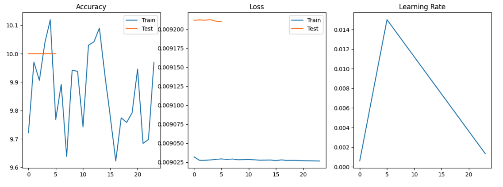

# Assignment 9 - Introduction to transformers 

## **Problem statement**

Build the following network:

* That takes a CIFAR10 image (32x32x3)
* Add 3 Convolutions to arrive at AxAx48 dimensions (e.g. 32x32x3 | 3x3x3x16 >> 3x3x16x32 >> 3x3x32x48)
* Apply GAP and get 1x1x48, call this X
* Create a block called ULTIMUS that:
    * Creates 3 FC layers called K, Q and V such that:
        * X*K = 48*48x8 > 8
        * X*Q = 48*48x8 > 8 
        * X*V = 48*48x8 > 8 
    * Create AM = SoftMax(QTK)/(8^0.5) = 8*8 = 8
    * Z = V*AM = 8*8 > 8
    * ther FC layer called Out that:
    * Z*Out = 8*8x48 > 48
* Repeat this Ultimus block 4 times
* Then add final FC layer that converts 48 to 10 and sends it to the loss function.
* Model would look like this C>C>C>U>U>U>U>FFC>Loss
* Train the model for 24 epochs using the OCP that I wrote in class. Use ADAM as an optimizer. 
* Submit the link and answer the questions on the assignment page:
    * Share the link to the main repo (must have Assignment 7/8/9 model7/8/9.py files (or similarly named))
    * Share the code of model9.py
    * Copy and paste the Training Log
    * Copy and paste the training and validation loss chart

## **Model Summary**

```
----------------------------------------------------------------
        Layer (type)               Output Shape         Param #
================================================================
            Conv2d-1           [-1, 16, 32, 32]             432
              ReLU-2           [-1, 16, 32, 32]               0
       BatchNorm2d-3           [-1, 16, 32, 32]              32
            Conv2d-4           [-1, 32, 32, 32]           4,608
              ReLU-5           [-1, 32, 32, 32]               0
       BatchNorm2d-6           [-1, 32, 32, 32]              64
            Conv2d-7           [-1, 48, 32, 32]          13,824
              ReLU-8           [-1, 48, 32, 32]               0
       BatchNorm2d-9           [-1, 48, 32, 32]              96
AdaptiveAvgPool2d-10             [-1, 48, 1, 1]               0
        Embedding-11             [-1, 48, 1, 1]               0
           Linear-12                    [-1, 8]             392
           Linear-13                    [-1, 8]             392
           Linear-14                    [-1, 8]             392
           Linear-15                   [-1, 48]             432
          Ultimus-16                   [-1, 48]               0
           Linear-17                    [-1, 8]             392
           Linear-18                    [-1, 8]             392
           Linear-19                    [-1, 8]             392
           Linear-20                   [-1, 48]             432
          Ultimus-21                   [-1, 48]               0
           Linear-22                    [-1, 8]             392
           Linear-23                    [-1, 8]             392
           Linear-24                    [-1, 8]             392
           Linear-25                   [-1, 48]             432
          Ultimus-26                   [-1, 48]               0
           Linear-27                    [-1, 8]             392
           Linear-28                    [-1, 8]             392
           Linear-29                    [-1, 8]             392
           Linear-30                   [-1, 48]             432
          Ultimus-31                   [-1, 48]               0
           Linear-32                   [-1, 10]             490
================================================================
Total params: 25,978
Trainable params: 25,978
Non-trainable params: 0
----------------------------------------------------------------
Input size (MB): 0.01
Forward/backward pass size (MB): 2.25
Params size (MB): 0.10
Estimated Total Size (MB): 2.37
----------------------------------------------------------------
```

## **Answers**

1. Submit the link and answer the questions on the assignment page - https://github.com/raguram/EVA8P1/tree/main/S9%20-%20Introduction%20to%20transformers

2. Share the code of model9.py - https://github.com/raguram/EVA8P1/blob/main/S9%20-%20Introduction%20to%20transformers/models/ultimus.py

3. Copy and paste the Training Log - https://github.com/raguram/EVA8P1/blob/main/S9%20-%20Introduction%20to%20transformers/S9-TransformerUltimus.ipynb

4. Copy and paste the training and validation loss chart

